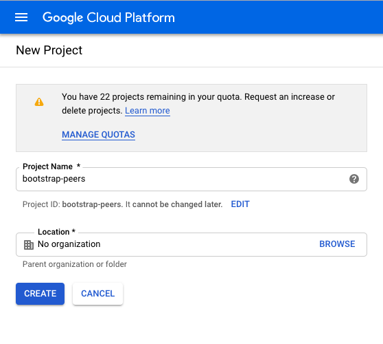
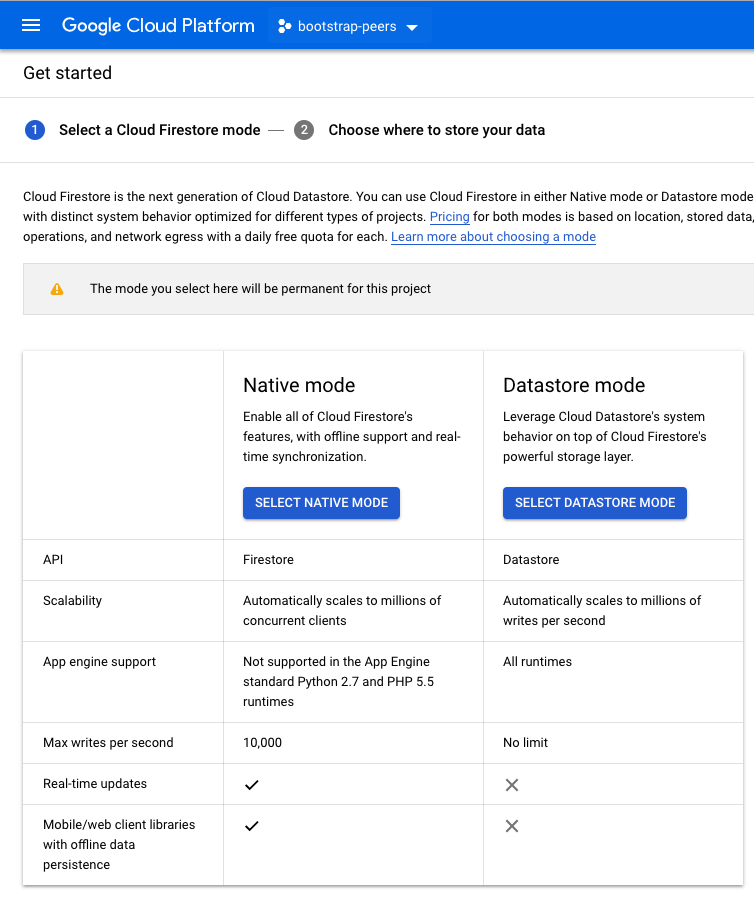
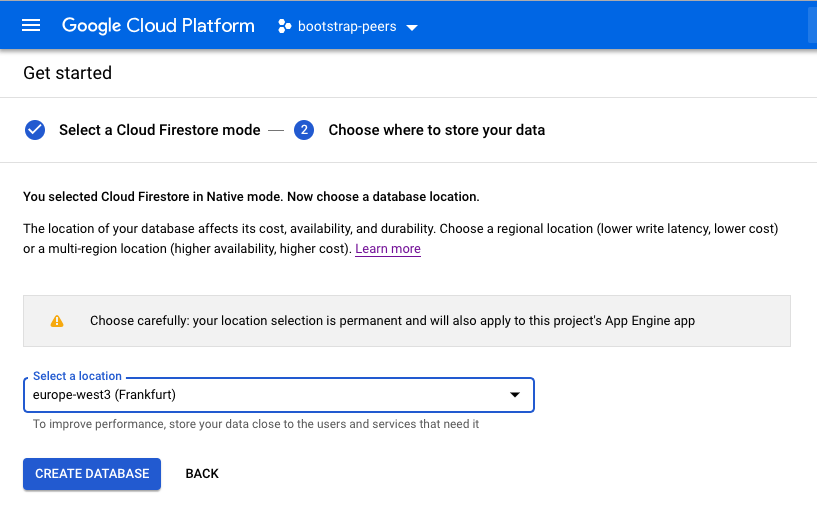
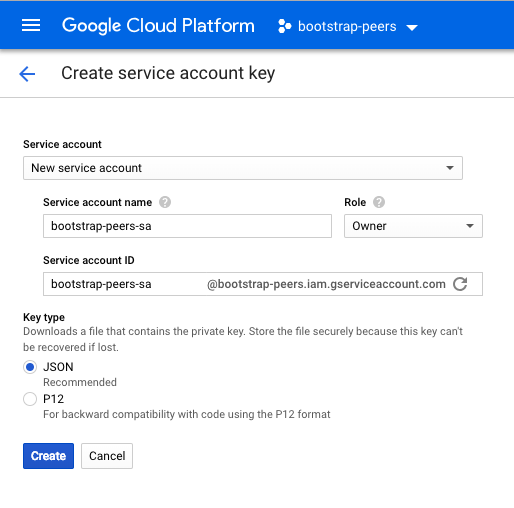

# Cloud Functions As Bootstrap Service

[](https://github.com/stefanhans/programming-reactive-systems-in-go/blob/master/LICENSE)
[](https://godoc.org/github.com/stefanhans/programming-reactive-systems-in-go/bootstrap-data-cloudfunctions)

### The Cloud Functions Are Already Deployed

Please go to **Test Cloud Functions API** to the end of this README.

---

Here is how to do it from scratch:

[Cloud Firestore Quickstart](https://cloud.google.com/firestore/docs/quickstart-servers#set_up_authentication)

gcloud config set account `ACCOUNT`

### Create new GCP project

**Edit Project Name and ```CREATE```**




### Start Cloud Firestore

**```SELECT NATIVE MODE```**



**Select a location and ```CREATE DATABASE```**




### Create new service account key

IAM & admin -> Service accounts

**Edit Service account name, choose Role Owner and```CREATE```**



**Save the JSON file with your private key**


**Prepare your environment**

```
export GCP_PROJECT="bootstrap-data-cloudfunctions"
export GOOGLE_APPLICATION_CREDENTIALS="/Users/stefan/.secret/bootstrap-data-cloudfunctions-c628b7847572.json"
export GCP_SA_BOOTSTRAP_PEERS="sa-owner-bootstrap-data@bootstrap-data-cloudfunctions.iam.gserviceaccount.com"
```


**Prepare your Cloud SDK**

[Cloud SDK Quickstarts](https://cloud.google.com/sdk/docs/quickstarts)

Find appropriate region for Cloud Functions
```
gcloud functions regions list
export GCP_REGION="europe-west1"
```

Set account, project and region for Cloud Function
```
gcloud auth activate-service-account $GCP_SA_BOOTSTRAP_PEERS --key-file=$GOOGLE_APPLICATION_CREDENTIALS
gcloud config set project $GCP_PROJECT
gcloud config set functions/region $GCP_REGION
```

Check config
```
gcloud config list
```

**Prepare Cloud Functions for Go**

```
export GO111MODULE=on
go mod init
go mod edit -go=1.11
go mod vendor
```

**Deploy Cloud Functions**

```
gcloud functions deploy reset --entry-point Reset --runtime go111 --trigger-http
gcloud functions deploy join --entry-point Join --runtime go111 --trigger-http
gcloud functions deploy leave --entry-point Leave --runtime go111 --trigger-http
gcloud functions deploy refill --entry-point Refill --runtime go111 --trigger-http
gcloud functions deploy list --entry-point List --runtime go111 --trigger-http
gcloud functions deploy ping --entry-point Ping --runtime go111 --trigger-http
gcloud functions deploy config --entry-point ConfigUpdate --runtime go111 --trigger-http
```

**Test Cloud Functions**

```
export GCP_SERVICE_URL="https://$GCP_REGION-$GCP_PROJECT.cloudfunctions.net"

curl -s $GCP_SERVICE_URL/ping
curl -sd "3 1"  $GCP_SERVICE_URL/config

curl -sd "alice-id alice 127.0.0.1 12340 tcp test 1"  $GCP_SERVICE_URL/join
curl -sd "bob-id bob 127.0.0.1 12341 tcp test 2"  $GCP_SERVICE_URL/join

curl -sd "alice-id" $GCP_SERVICE_URL/leave
curl -s $GCP_SERVICE_URL/list

curl -sd "2 1"  $GCP_SERVICE_URL/config
curl -sd "alice-id alice 127.0.0.1 12341 tcp test 1552655444"  $GCP_SERVICE_URL/refill

curl -s $GCP_SERVICE_URL/reset
curl -s $GCP_SERVICE_URL/list
```

---

**Test Cloud Functions API**

```
cd ~/go/src/github.com/stefanhans/cli-chat/bootstrap-data-api

export BOOTSTRAP_DATA_SERVER="https://europe-west1-bootstrap-data-cloudfunctions.cloudfunctions.net"
go test -run TestCf
```
